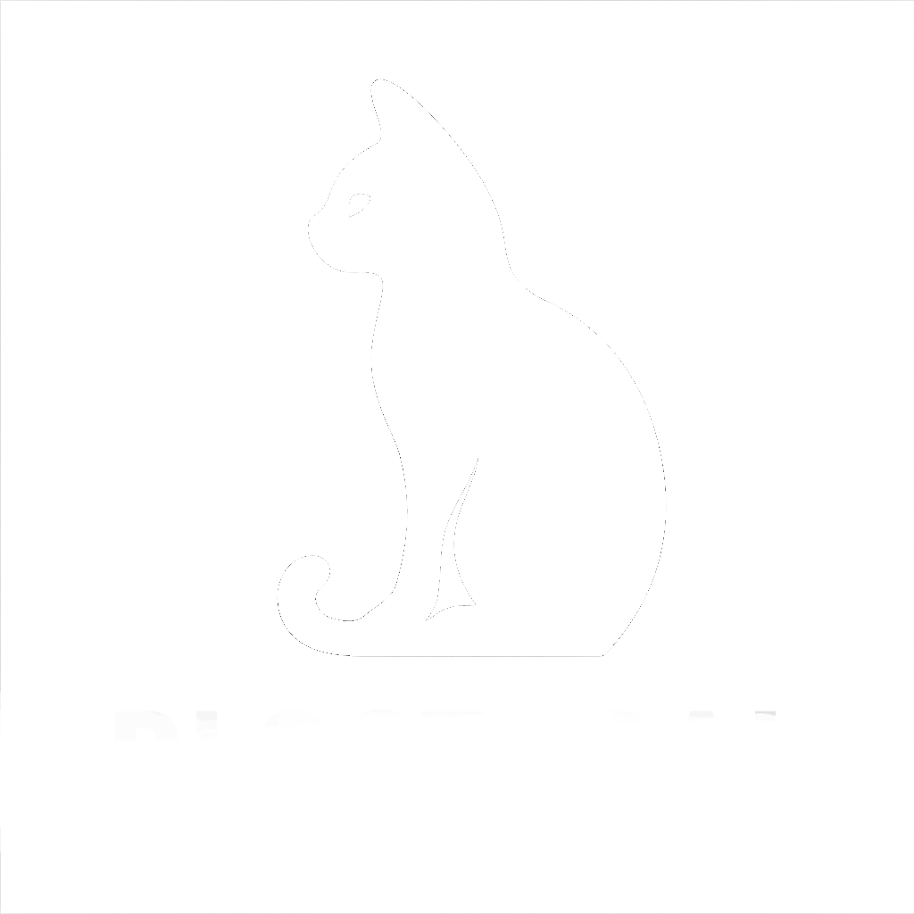
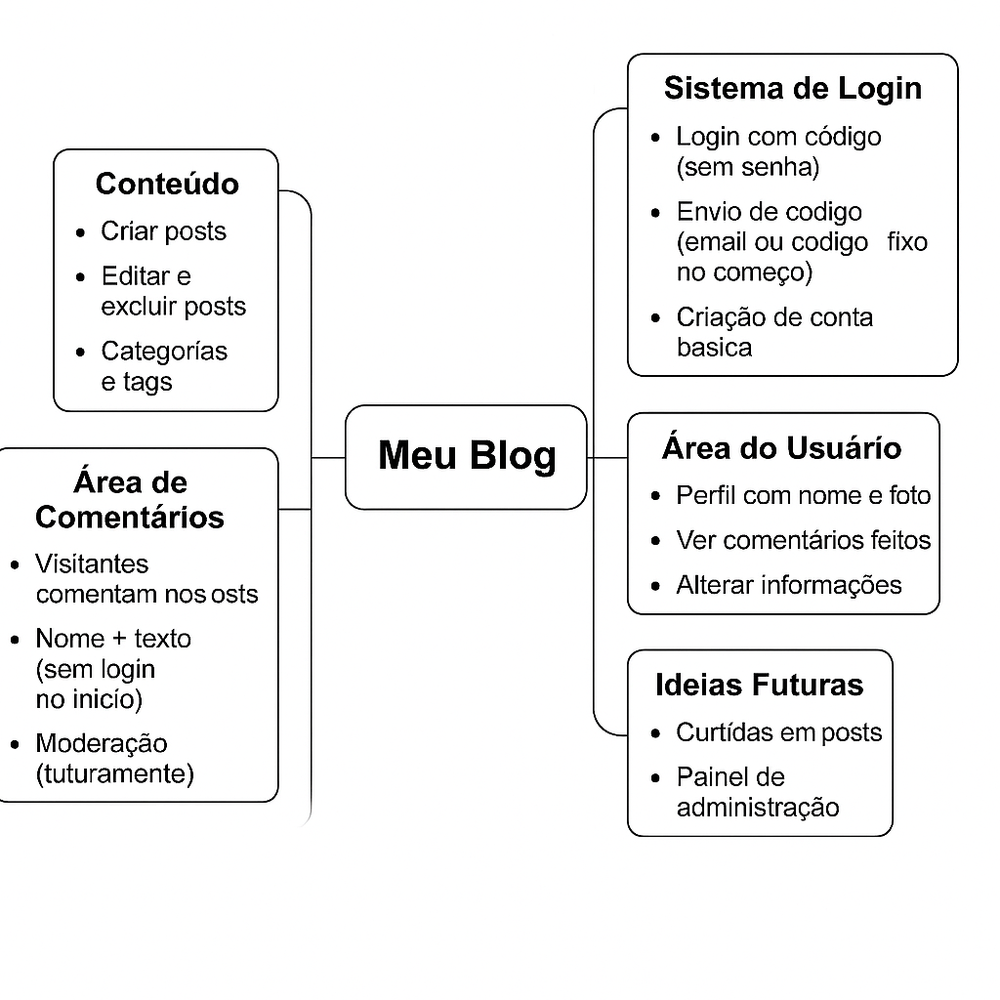

     



 ## BlgoTotal
**BlogTotal** é um projeto de blog desenvolvido para organizar, publicar e gerenciar conteúdos de forma simples e eficiente
## 🛠️ Tecnologias Utilizadas

- ✔️ Linguagem: JavaScript
- ✔️ Framework/CSS: Bootstrap
- ✔️ Fonte personalizada: Google Fonts
- ✔️ Sem uso de banco de dados até o momento (baseado em dados estáticos)

<pre>
📁 Home
├── blog.html       # Página principal do blog
├── blog.css        # Estilos personalizados
├── blog.js         # Lógica e interatividade

📁 IMG
├── foto1.jpg       # Imagem de exemplo
├── foto2.png       # Outra imagem
└── ...             # Outras imagens
📁Readme    
├── 51.png            # Logo "
├── NRH2.gif          # Gif do mascote"
├── readme.png        # Mapa mental"    

</pre>
<div align="center">

</div>


<div align="center">
  
</div>


## 📦 Instalação

Clone o repositório:

```bash
git clone https://github.com/seu-usuario/BlogTotal.git
cd BlogTotal
